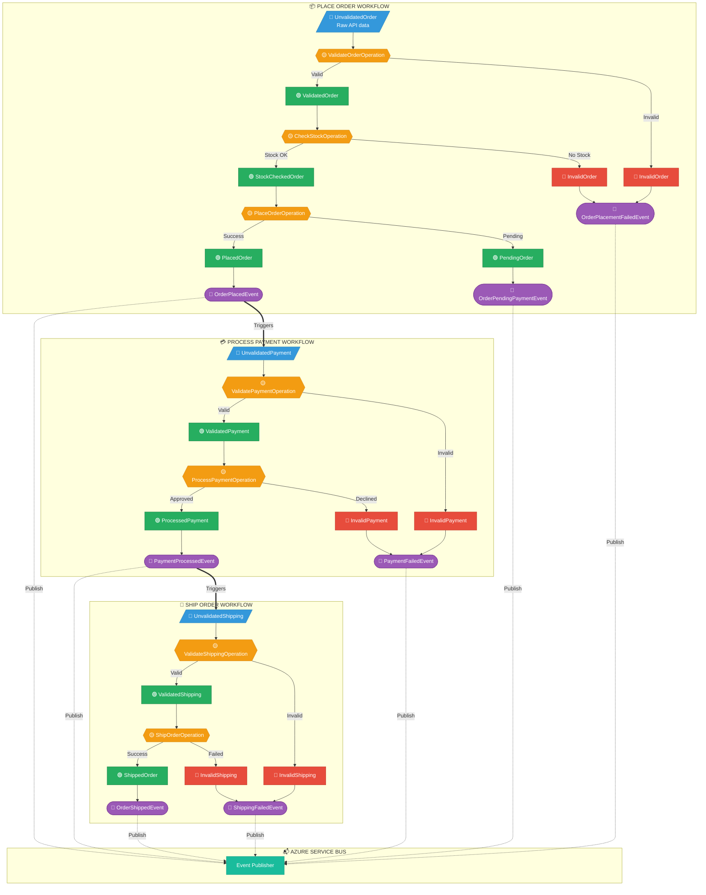

# ShopVRG - Workflows, States & Events Diagram

## Diagrama Completa

## Legendă

| Culoare | Semnificație |
|---------|--------------|
| 🔵 Albastru | Input State (Unvalidated) |
| 🟢 Verde | Valid State (Success) |
| 🔴 Roșu | Invalid State (Error) |
| 🟡 Galben | Operation (Transform) |
| 💜 Mov | Domain Event |
| 🩵 Cyan | Event Bus |

## Sumar Workflows

### 📦 Place Order Workflow
- **Stări:** UnvalidatedOrder → ValidatedOrder → StockCheckedOrder → PlacedOrder/PendingOrder
- **Evenimente:** OrderPlacedEvent, OrderPendingPaymentEvent, OrderPlacementFailedEvent

### 💳 Process Payment Workflow  
- **Stări:** UnvalidatedPayment → ValidatedPayment → ProcessedPayment
- **Evenimente:** PaymentProcessedEvent, PaymentFailedEvent

### 🚚 Ship Order Workflow
- **Stări:** UnvalidatedShipping → ValidatedShipping → ShippedOrder
- **Evenimente:** OrderShippedEvent, ShippingFailedEvent
