# ShopVRG - Workflows, States & Events Diagram

## Diagrama Completa

```mermaid
flowchart TB
    subgraph PlaceOrderWorkflow["📦 PLACE ORDER WORKFLOW"]
        direction TB
        
        UO[/"🔵 UnvalidatedOrder<br/>Raw API data"/]
        VOp{{"🟡 ValidateOrderOperation"}}
        VO["🟢 ValidatedOrder"]
        IO1["🔴 InvalidOrder"]
        CSOp{{"🟡 CheckStockOperation"}}
        SCO["🟢 StockCheckedOrder"]
        IO2["🔴 InvalidOrder"]
        POp{{"🟡 PlaceOrderOperation"}}
        PO["🟢 PlacedOrder"]
        PendO["🟢 PendingOrder"]
        
        E1(["📨 OrderPlacedEvent"])
        E2(["📨 OrderPlacementFailedEvent"])
        E3(["📨 OrderPendingPaymentEvent"])
        
        UO --> VOp
        VOp -->|"Valid"| VO
        VOp -->|"Invalid"| IO1
        IO1 --> E2
        
        VO --> CSOp
        CSOp -->|"Stock OK"| SCO
        CSOp -->|"No Stock"| IO2
        IO2 --> E2
        
        SCO --> POp
        POp -->|"Success"| PO
        POp -->|"Pending"| PendO
        
        PO --> E1
        PendO --> E3
    end

    subgraph ProcessPaymentWorkflow["💳 PROCESS PAYMENT WORKFLOW"]
        direction TB
        
        UP[/"🔵 UnvalidatedPayment"/]
        VPOp{{"🟡 ValidatePaymentOperation"}}
        VP["🟢 ValidatedPayment"]
        IP["🔴 InvalidPayment"]
        PPOp{{"🟡 ProcessPaymentOperation"}}
        PP["🟢 ProcessedPayment"]
        FP["🔴 InvalidPayment"]
        
        E4(["📨 PaymentProcessedEvent"])
        E5(["📨 PaymentFailedEvent"])
        
        UP --> VPOp
        VPOp -->|"Valid"| VP
        VPOp -->|"Invalid"| IP
        IP --> E5
        
        VP --> PPOp
        PPOp -->|"Approved"| PP
        PPOp -->|"Declined"| FP
        
        PP --> E4
        FP --> E5
    end

    subgraph ShipOrderWorkflow["🚚 SHIP ORDER WORKFLOW"]
        direction TB
        
        US[/"🔵 UnvalidatedShipping"/]
        VSOp{{"🟡 ValidateShippingOperation"}}
        VS["🟢 ValidatedShipping"]
        IS["🔴 InvalidShipping"]
        SOOp{{"🟡 ShipOrderOperation"}}
        SO["🟢 ShippedOrder"]
        FS["🔴 InvalidShipping"]
        
        E6(["📨 OrderShippedEvent"])
        E7(["📨 ShippingFailedEvent"])
        
        US --> VSOp
        VSOp -->|"Valid"| VS
        VSOp -->|"Invalid"| IS
        IS --> E7
        
        VS --> SOOp
        SOOp -->|"Success"| SO
        SOOp -->|"Failed"| FS
        
        SO --> E6
        FS --> E7
    end

    subgraph EventBus["📬 AZURE SERVICE BUS"]
        EB["Event Publisher"]
    end

    E1 -.->|"Publish"| EB
    E2 -.->|"Publish"| EB
    E3 -.->|"Publish"| EB
    E4 -.->|"Publish"| EB
    E5 -.->|"Publish"| EB
    E6 -.->|"Publish"| EB
    E7 -.->|"Publish"| EB

    E1 ==>|"Triggers"| UP
    E4 ==>|"Triggers"| US

    classDef inputState fill:#3498db,stroke:#2980b9,color:#fff
    classDef validState fill:#27ae60,stroke:#1e8449,color:#fff
    classDef invalidState fill:#e74c3c,stroke:#c0392b,color:#fff
    classDef operation fill:#f39c12,stroke:#d68910,color:#fff
    classDef event fill:#9b59b6,stroke:#7d3c98,color:#fff
    classDef eventbus fill:#1abc9c,stroke:#16a085,color:#fff
    
    class UO,UP,US inputState
    class VO,SCO,PO,PendO,VP,PP,VS,SO validState
    class IO1,IO2,IP,FP,IS,FS invalidState
    class VOp,CSOp,POp,VPOp,PPOp,VSOp,SOOp operation
    class E1,E2,E3,E4,E5,E6,E7 event
    class EB eventbus
```

## Legendă

| Culoare | Semnificație |
|---------|--------------|
| 🔵 Albastru | Input State (Unvalidated) |
| 🟢 Verde | Valid State (Success) |
| 🔴 Roșu | Invalid State (Error) |
| 🟡 Galben | Operation (Transform) |
| 💜 Mov | Domain Event |
| 🩵 Cyan | Event Bus |

## Sumar Workflows

### 📦 Place Order Workflow
- **Stări:** UnvalidatedOrder → ValidatedOrder → StockCheckedOrder → PlacedOrder/PendingOrder
- **Evenimente:** OrderPlacedEvent, OrderPendingPaymentEvent, OrderPlacementFailedEvent

### 💳 Process Payment Workflow  
- **Stări:** UnvalidatedPayment → ValidatedPayment → ProcessedPayment
- **Evenimente:** PaymentProcessedEvent, PaymentFailedEvent

### 🚚 Ship Order Workflow
- **Stări:** UnvalidatedShipping → ValidatedShipping → ShippedOrder
- **Evenimente:** OrderShippedEvent, ShippingFailedEvent
